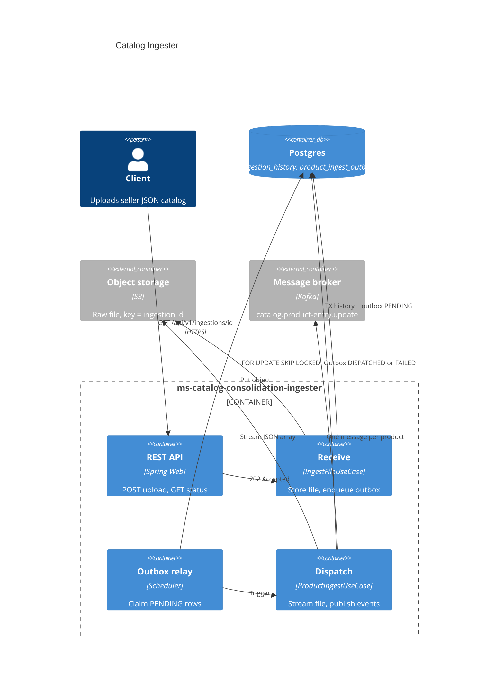
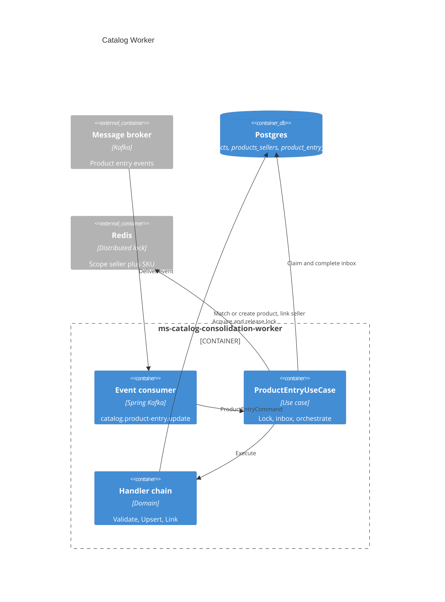

# Catalog Consolidation

VTEX take-home assessment: a marketplace-style system that ingests seller product files, deduplicates catalog items, and records which sellers offer each product.

For architecture, data model, and consolidation rules see **[docs/Catalog_Consolidation_System.md](docs/Catalog_Consolidation_System.md)**. The original take-home brief is in **[docs/Catalog_Consolidation_System-Assessment.md](docs/Catalog_Consolidation_System-Assessment.md)**. Design decisions and trade-offs are in **[docs/Catalog_Consolidation_System-Decisions.md](docs/Catalog_Consolidation_System-Decisions.md)**.

## Problem (summary)

Sellers upload JSON catalogs. The marketplace already has a product catalog (seeded from SQLite). When a new entry matches an existing product, the system must **not** create a duplicate row in `products` — it should **link the seller** in `products_sellers`. When the product is new, it creates both the product and the link.

## Solution overview

Two Spring Boot services share Postgres and communicate through Kafka (Redpanda):

| Service | Role |
|---|---|
| `ms-catalog-consolidation-ingester` | Receives the file, stores it in S3, enqueues async dispatch via outbox, streams the file and publishes one Kafka event per product |
| `ms-catalog-consolidation-worker` | Consumes product-entry events, matches or creates catalog products, links sellers, records outcomes in an inbox |

### Ingester (`ms-catalog-consolidation-ingester`)



### Worker (`ms-catalog-consolidation-worker`)



Full walkthrough: [docs/Catalog_Consolidation_System.md](docs/Catalog_Consolidation_System.md).

## Quick start

**Requirements:** Docker, Docker Compose, curl. Make is optional (convenience wrappers).

```bash
./docker/postgres/reset-db.sh   # first time or after schema changes
docker compose up --build -d
curl -F "file=@ms-catalog-consolidation-ingester/data/samples/product-entry.json" \
  http://localhost:9090/api/v1/ingestions
docker compose logs -f
```

Or with Make: `make reset-db && make up && make ingest && make logs`

- **Gateway (nginx):** `http://localhost:11000` — `/ingester`, `/worker`, `/grafana`
- **Ingester API:** `http://localhost:9090` (or `http://localhost:11000/ingester`)
- **Grafana:** `http://localhost:3000` or `http://localhost:11000/grafana` (admin / `${GRAFANA_ADMIN_PASSWORD:-admin}`)
- **Prometheus:** `http://localhost:9091`
- **Postgres:** `localhost:5433` (user/password/db: `catalog`)
- **Kafka (external):** `localhost:19092`

Upload a file manually:

```bash
curl -F "file=@ms-catalog-consolidation-ingester/data/samples/product-entry.json" \
  http://localhost:9090/api/v1/ingestions
```

For consolidation edge cases (same seller / different seller ids, SKU collisions, validation rejects), use the smaller fixture and see [product_entry_edge_cases.md](ms-catalog-consolidation-ingester/data/samples/product_entry_edge_cases.md):

```bash
make ingest-edge-cases
```

Poll status:

```bash
curl http://localhost:9090/api/v1/ingestions/{id}
```

Example `202 Accepted` body:

```json
{
  "id": "...",
  "fileName": "product-entry.json",
  "status": "PENDING",
  "failureReason": null,
  "createdAt": "...",
  "updatedAt": "..."
}
```

Outbox status values: `PENDING` → `PROCESSING` → `DISPATCHED` (all events published) or `FAILED`.

## Observability

`docker compose up` also starts Prometheus and Grafana. Grafana provisions the **Catalog Processing** dashboard automatically with a 15-minute window and 5-second refresh. It shows product outcome distribution, processing p50/p95, dispatched and handled event rates, Redpanda consumer lag, endpoint p50/p95, and process/HTTP error rates.

Prometheus retains seven days of local metrics and scrapes:

- ingester: `/actuator/prometheus`
- worker: internal port `9091`, `/actuator/prometheus`
- Redpanda: `/public_metrics`

Set `GRAFANA_ADMIN_PASSWORD` before `docker compose up` to change the local default password.

## Repository layout

```text
docker-compose.yml                   Run the full stack from repo root
ms-catalog-consolidation-ingester/   Upload, S3, outbox relay, Kafka producer
ms-catalog-consolidation-worker/     Kafka consumer, catalog consolidation
docker/                              Postgres schema, seed migration, nginx, observability
docs/                                System design, assessment brief, `database/catalog.db` seed
```

## Make targets

| Command | Description |
|---|---|
| `make build` | Package both services with Maven |
| `make up` | Build and start all containers |
| `make down` | Stop containers |
| `make logs` | Follow service logs |
| `make ingest` | POST the sample JSON file |
| `make ingest-edge-cases` | POST the edge-case fixture (13 scenarios) |
| `make reset-db` | Recreate Postgres schema and catalog seed |
| `make run-ingester` | Run ingester locally (infra must be up) |
| `make run-worker` | Run worker locally (infra must be up) |

## Design highlights

- **Transactional outbox** (`product_ingest_outbox`) decouples file upload from async file processing.
- **One Kafka message per product** on `catalog.product-entry.update` with stable `correlationId = {ingestionId}:{entryIndex}`.
- **Worker inbox** (`product_entry_inbox`) + **Redis lock** for idempotent, concurrent-safe consolidation.
- **SKU matching** — canonical `brand#name` (hyphenated slug) indexed on `products.sku`.
- **Outbox claim** — relay uses `FOR UPDATE SKIP LOCKED` so multiple ingester instances do not double-dispatch.

## Tests

```bash
cd ms-catalog-consolidation-ingester && mvn test
cd ms-catalog-consolidation-worker && mvn test
```

## Deliberate limits

- Product dedup is by normalized brand + name (SKU), not fuzzy matching.
- Seed data may have null or inconsistent brands; mismatches can create extra products.
- File dispatch is all-or-nothing per outbox attempt (no mid-file resume checkpoint).
- No callback from worker to ingester; consolidation outcomes live in `product_entry_inbox`.
