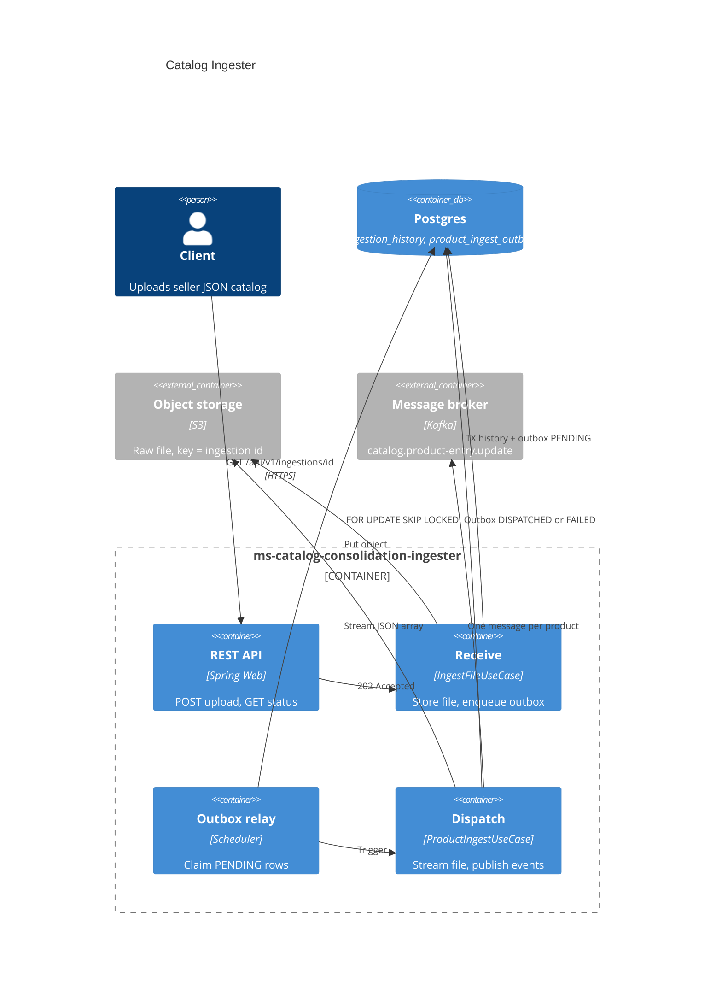
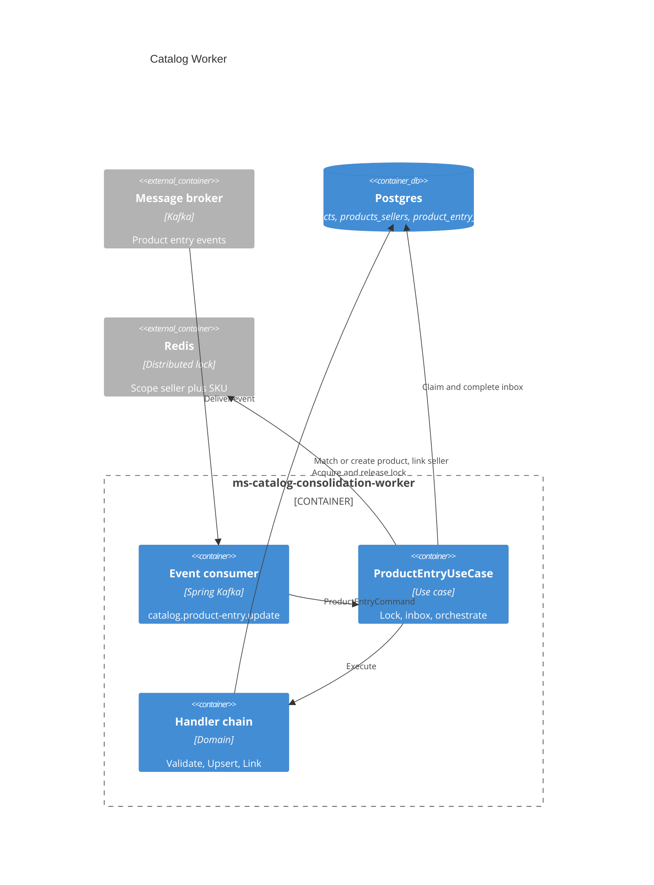

# Catalog Consolidation System

This document describes the architecture, data flow, and consolidation rules implemented for the VTEX catalog consolidation assessment.

## Business goal

A marketplace receives product catalogs from multiple sellers. The same real-world item may appear in several files with slightly different fields. The system must:

1. Add new products to the shared catalog.
2. **Avoid duplicate product rows** when the item already exists.
3. **Record which sellers offer each product** (`products_sellers` links).

Matching uses a persisted **SKU** derived from canonical brand and name (see [Product matching](#product-matching)).

---

## System diagrams

C4 container views (render on GitHub via Mermaid). The ingester has two phases — **receive** and **dispatch** — inside one service; the worker consumes Kafka and writes the catalog.

### Ingester



### Worker



### Phase 1 — Receive the file

> *Receives the file, stores it, and dispatches for ingestion.*

| Step | Component | Action |
|---|---|---|
| 1 | Client | `POST /api/v1/ingestions` (multipart `file`) |
| 2 | **Ingester** | Generate `ingestionId`, store file in **S3** (object key = id) |
| 3 | **Ingester** | Insert **ingestion_history** (file name + chronology) |
| 4 | **Ingester** | Insert **product_ingest_outbox** row (`PENDING`) in the same DB transaction |
| 5 | API | Return `202 Accepted` with `status: PENDING` |

The HTTP handler returns immediately. No parsing happens on the request thread.

### Phase 2 — Slice and publish

> *Slices the file and dispatches products for catalog intake.*

| Step | Component | Action |
|---|---|---|
| 1 | **Relay** | Poll `product_ingest_outbox` for `PENDING` rows |
| 2 | **Ingester** (`ProductIngestUseCase`) | Stream JSON array from S3 |
| 3 | **Ingester** | For each product: publish **ProductEntryUpdateEvent** to Kafka |
| 4 | **Ingester** | Mark outbox `DISPATCHED`, touch `ingestion_history.updated_at` |

Kafka messages (conceptually one box per product):

```text
  [event 0]  [event 1]  [event 2]  ...  [event N]
       \        |         |              /
        `-------+---------+--------------´
                         |
                  catalog.product-entry.update
```

Each event carries:

| Field | Description |
|---|---|
| `ingestionId` | Upload id (same as S3 key) |
| `correlationId` | `{ingestionId}:{entryIndex}` — stable across retries |
| `product` | Seller product payload (id, name, brand, category, seller name) |

On invalid JSON the outbox row is marked **`FAILED`** (non-retryable). Transient errors use the relay retry policy until `max-attempts`.

### Phase 3 — Consolidate

> *Worker consumes events and writes the catalog.*

| Step | Component | Action |
|---|---|---|
| 1 | **Worker** | Consume `catalog.product-entry.update` |
| 2 | **Worker** | Acquire Redis lock on idempotency key (`seller#brand#name`) |
| 3 | **Worker** | Claim **product_entry_inbox** row (`status` null while processing) |
| 4 | **Worker** | Run handler chain (validate → upsert → link) |
| 5 | **Worker** | Complete inbox with status + reason, release lock |

There is **no callback** from worker to ingester. Poll upload status via the outbox; inspect consolidation via `product_entry_inbox`.

---

## Services

### ms-catalog-consolidation-ingester

| Layer | Responsibility |
|---|---|
| `entrypoint/api` | REST upload + poll |
| `application/usecase` | `IngestFileUseCase`, `ProductIngestUseCase`, `GetIngestionByIdUseCase` |
| `dataprovider` | S3, JPA (history + outbox), Kafka producer, JSON streaming reader |
| `infrastructure` | Outbox relay scheduler, Kafka config |

Hexagonal layout: use cases depend on gateway ports; adapters live in `dataprovider`.

### ms-catalog-consolidation-worker

| Layer | Responsibility |
|---|---|
| `entrypoint/messaging` | Kafka consumer |
| `application/usecase` | `ProductEntryUseCase` + handler chain |
| `dataprovider` | Catalog JPA, inbox, Redis lock |
| `infrastructure` | Event DTOs, configuration |

Handler chain (instantiated in factory, not Spring beans):

```text
  ValidationHandler  -->  UpsertHandler  -->  LinkHandler
       |                      |                  |
  ALREADY_LINKED?         find/create         link seller
  (seller link exists)    product by SKU        set CREATED/LINKED
```

---

## Data model (Postgres)

### Catalog (seed + runtime)

| Table | Purpose |
|---|---|
| `products` | Canonical catalog items; unique `sku` |
| `products_sellers` | Links `(seller_name, seller_product_id)` → `products` |

Seed data is migrated from [`docs/database/catalog.db`](database/catalog.db) (assessment SQLite) via `docker/postgres/migrate_sqlite.py`.

### Ingester

| Table | Purpose |
|---|---|
| `ingestion_history` | Audit: `id`, `file_name`, `created_at`, `updated_at` |
| `product_ingest_outbox` | Async file job: `PENDING` / `PROCESSING` / `DISPATCHED` / `FAILED` |

### Worker

| Table | Purpose |
|---|---|
| `product_entry_inbox` | Per-event outcome; PK = `correlation_id` |

Inbox columns include `idempotency_key` (for lock scope), `status`, `reason`, `created_at`, and `updated_at`. Each Kafka message gets its own inbox row even when the catalog outcome is `ALREADY_LINKED`.

---

## Product matching

SKU is built with the same rules in seed migration and runtime:

```text
sku = canonical(brand) + "#" + canonical(name)

canonical: lowercase, strip diacritics, spaces → hyphens, remove other punctuation
```

Example: `"Smartphone Galaxy S23"` + `"Samsung"` → `samsung#smartphone-galaxy-s23`

Consolidation outcomes:

| Status | Meaning |
|---|---|
| `CREATED` | New product row and new seller link |
| `LINKED` | Existing product (SKU match); seller link added |
| `ALREADY_LINKED` | Same seller + seller product id already linked |
| `REJECTED` | Validation failed (e.g. missing required fields) |

---

## Idempotency and concurrency

| Concern | Mechanism |
|---|---|
| Same Kafka message redelivered | Inbox PK = `correlation_id`; skip if already completed |
| Concurrent events for same product | Redis lock on `idempotency_key` (`seller#sku`) |
| Outbox relay retry after crash | Stable `correlationId`; worker skips completed entries; re-publishes remainder |
| Duplicate upload | New `ingestionId` → new events and inbox rows |

---

## Infrastructure (Docker Compose)

| Service | Port | Role |
|---|---|---|
| `postgres` | 5433 | Shared database |
| `localstack` | 4566 | S3-compatible storage |
| `redis` | 6379 | Worker distributed locks |
| `redpanda` | 19092 | Kafka-compatible broker |
| `ms-catalog-consolidation-ingester` | 9090 | REST + relay + producer |
| `ms-catalog-consolidation-worker` | — | Consumer (no HTTP) |

---

## API reference

### `POST /api/v1/ingestions`

- **Content-Type:** `multipart/form-data`
- **Part:** `file` — JSON array of seller products
- **Response:** `202 Accepted`

### `GET /api/v1/ingestions/{id}`

Returns history + outbox dispatch status.

---

## ASCII reference (matches design sketch)

```text
  {...}
    |
    v
+-----------+     +-----+
| ingester  |---->| S3  |
| (upload)  |     +-----+
+-----------+
    |
    +--------> [ outbox ] ----> [ relay ] ----> +-----------+
                                                 | ingester  |
                                                 | (dispatch)|
                                                 +-----------+
                                                       |
                                                       v
                                              [ msg ][ msg ][ msg ]...
                                                       |
                                                       | (Kafka)
                                                       v
                                                 +-----------+     +---------+
                                                 |  worker   |---->| catalog |
                                                 +-----------+     +---------+
```

---

## Related files

- [README.md](../README.md) — quick start and commands
- [Catalog_Consolidation_System-Assessment.md](Catalog_Consolidation_System-Assessment.md) — original assessment brief
- [docker/postgres/01-schema.sql](../docker/postgres/01-schema.sql) — database DDL
